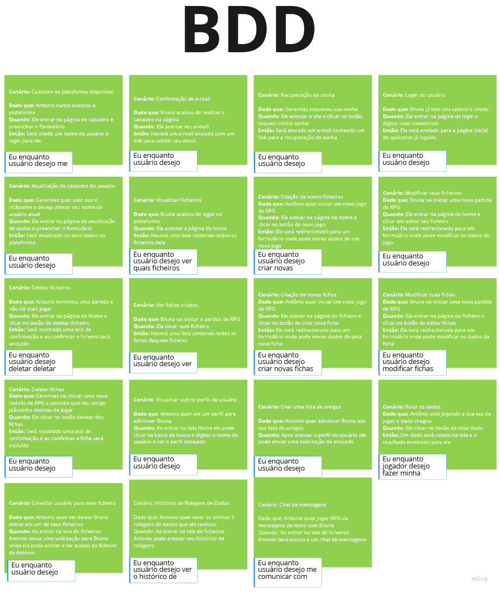

# Behavior Drive Development (BDD)

## Histórico de Versão
|    Data    | Versão |                Descrição                |                     Autor                     |
| :--------: | :----: | :-------------------------------------: | :-------------------------------------------: |
| 16/03/2022 | 1.0 | Criação do BDD|  [Natan Santana](https://github.com/Neitan2001), [Leonardo Takehana](https://github.com/ltakehana), [João Paulo Lima](https://github.com/jpaulohe4rt), [Gabriel Freitas](https://github.com/gabrielfreitass1), [Luíz Gustavo](https://github.com/LuizGustavoFR) |
| 27/04/2022 | 2.0 | Versão final do BDD| [Gabriel Freitas](https://github.com/gabrielfreitass1)|

O BDD é uma metodologia de desenvolvimento ágil que foca no comportamento esperado de um sistema baseado em requisitos de negócios bem definidos, utilizando práticas de levantamento de requisitos como “histórias de usuários” e “critérios de aceitação”.

 
<a href="https://miro.com/app/board/uXjVONjoEoU=/">Link para o nosso BDD completo</a>
 
<a href="https://docs.google.com/spreadsheets/d/1Yuifr4S3yzCtYWAnAohY2NCN6NN7VfXRMEdDdgyCWP4/edit?usp=sharing">Link para o nosso Backlog com todos os critérios de aceitação das histórias de usuário</a>

