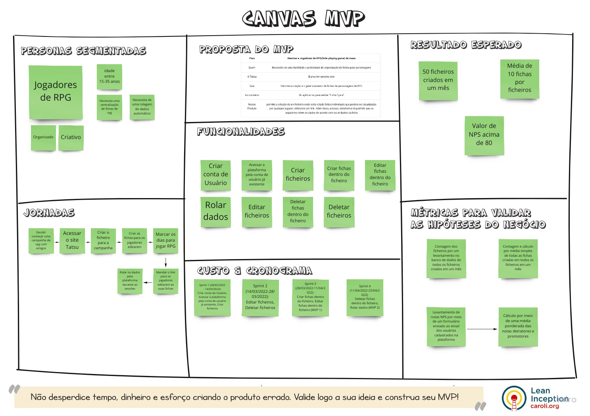

# Canvas MVP

## Histórico de Versão
|    Data    | Versão |                Descrição                |                     Autor                     |
| :--------: | :----: | :-------------------------------------: | :-------------------------------------------: |
| 21/02/2022 | 1.0 | Criação do Canvas MVP|  [Natan Santana](https://github.com/Neitan2001), [Leonardo Takehana](https://github.com/ltakehana), [João Paulo Lima](https://github.com/jpaulohe4rt), [Gabriel Freitas](https://github.com/gabrielfreitass1), [Luíz Gustavo](https://github.com/LuizGustavoFR) |
| 26/04/2022 | 2.0 | Atualização do Canvas MVP| [Gabriel Freitas](https://github.com/gabrielfreitass1)|

O Canvas MVP é uma ferramenta para validar ideias de produtos. É um quadro visual que auxilia empreendedores a alinhar e definir a estratégia do MVP–Minimum Viable Product, em inglês, a versão mais simples de um produto que pode ser disponibilizada para o negócio (produto mínimo) e que possa ser efetivamente utilizado e validado pelo usuário final (produto viável)

 
<a href="https://miro.com/app/board/uXjVONjoEoU=/">Link para o nosso Canvas MVP</a>

Fonte: https://www.caroli.org/o-canvas-mvp/
