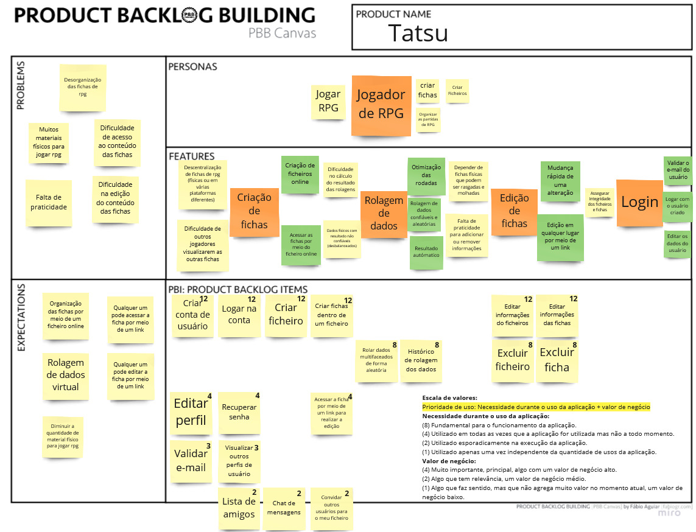

# Product Backlog Building (PBB)

## Histórico de Versão
|    Data    | Versão |                Descrição                |                     Autor                     |
| :--------: | :----: | :-------------------------------------: | :-------------------------------------------: |
| 16/03/2022 | 1.0 | Criação do PBB|  [Natan Santana](https://github.com/Neitan2001), [Leonardo Takehana](https://github.com/ltakehana), [João Paulo Lima](https://github.com/jpaulohe4rt), [Gabriel Freitas](https://github.com/gabrielfreitass1), [Luíz Gustavo](https://github.com/LuizGustavoFR) |
| 27/04/2022 | 2.0 | Versão final do PBB|[Leonardo Takehana](https://github.com/ltakehana), [João Paulo Lima](https://github.com/jpaulohe4rt), [Gabriel Freitas](https://github.com/gabrielfreitass1), [Luíz Gustavo](https://github.com/LuizGustavoFR) |

O principal objetivo do PBB é ajudar a construir backlogs de forma compartilhada, construir um entendimento comum e levar todos os envolvidos a um entendimento colaborativo do domínio do negócio, ou seja, todos entendem o contexto do negócio.

 
<a href="https://miro.com/app/board/uXjVONjoEoU=/">Link para o nosso PBB completo</a>