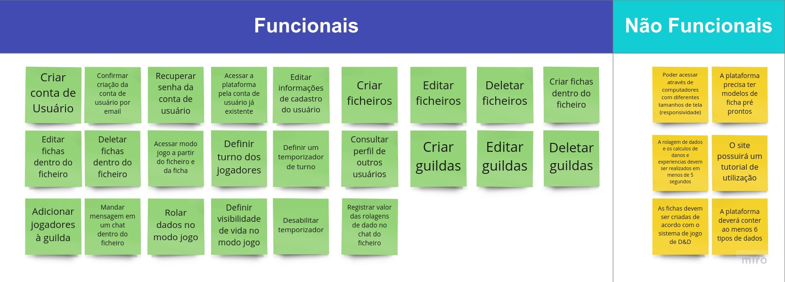
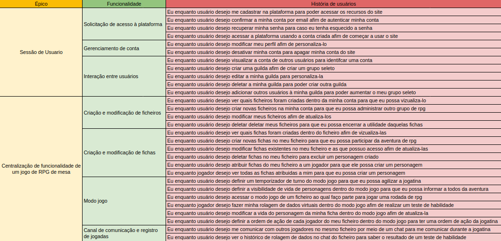

# Levantamento de Requisitos Iniciais

O levantamento inicial de requisitos funcionais e não-funcionais da plataforma Tatsu foi realizada no dia 10/02/2022 pelos integrante do grupo Tatsu. Para essa atividade, foi realizado um brainstorm de requisitos na plataforma Miro. Depois do brainstorm, os requisitos foram divididos em Funcionais e Não-Funcionais de acordo com a tabela a seguir:

 
<a href="https://miro.com/app/board/uXjVONjoEoU=/">Link para Tabela de Requisitos</a>
 
 
Com os requisitos levatados, discutimos cada um e os agrupos de acordo com a organização proposta pelo SAFe. O resultado foi registrado em uma planilha do Google Sheets e pode ser visualizado na imagem a seguir:

<a href="https://docs.google.com/spreadsheets/d/1S9N1mGhqyCEaqy_d7cmHOFikam1gNrSFgVK8zxZhkv4/edit?usp=sharing">Link para Planilha do SAFe</a>
