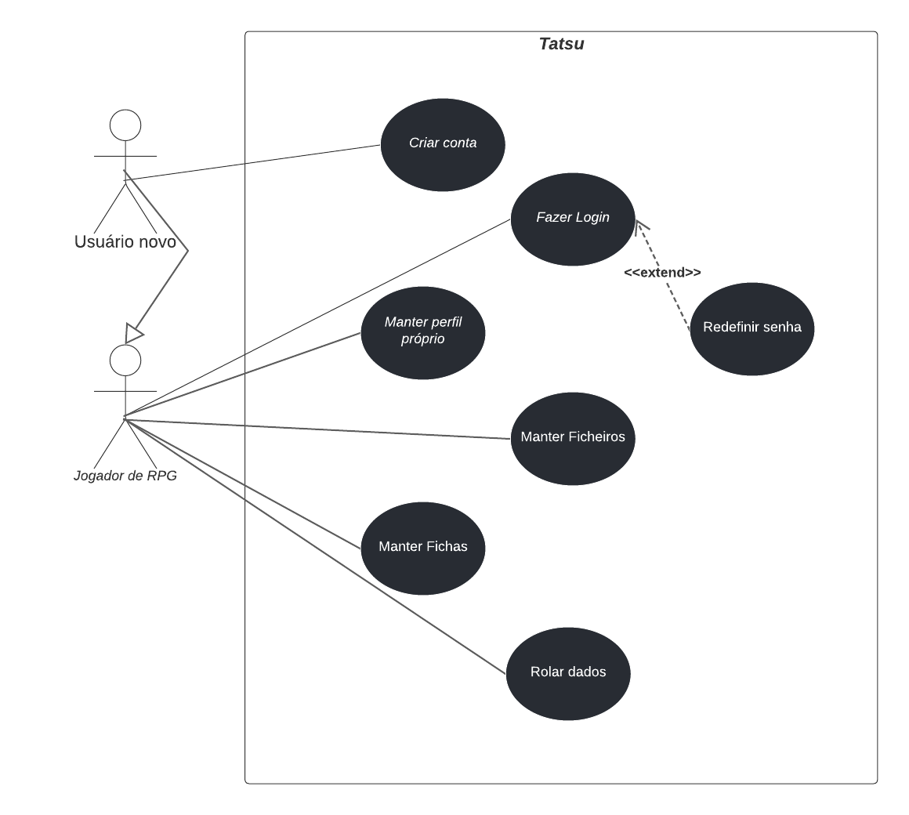

# Casos de Uso

## Histórico de Versão
|    Data    | Versão |                Descrição                |                     Autor                     |
| :--------: | :----: | :-------------------------------------: | :-------------------------------------------: |
| 25/04/2022 |  1.0   | Criação do Documento Diagrama de Casos de Uso |[Leonardo Takehana](https://github.com/ltakehana), [João Paulo Lima](https://github.com/jpaulohe4rt), [Gabriel Freitas](https://github.com/gabrielfreitass1), [Luíz Gustavo](https://github.com/LuizGustavoFR) |
| 27/04/2022 |  2.0   | Revisão dos fluxos e de outros pontos do documento. |[Leonardo Takehana](https://github.com/ltakehana), [João Paulo Lima](https://github.com/jpaulohe4rt), [Gabriel Freitas](https://github.com/gabrielfreitass1), [Luíz Gustavo](https://github.com/LuizGustavoFR) |

O diagrama de caso de uso tem como objetivo resumir os detalhes dos usuários do sistema (também conhecidos como atores) e as interações deles com o sistema.

 
<a href="https://lucid.app/lucidchart/ae4233ad-e531-44be-b961-696152307382/edit?invitationId=inv_8ac4596d-9ca2-4c56-babc-58f933c1278a">Link para o nosso diagrama de casos de uso completo</a>

# Breve Descrição

Caso de Uso referente a um usuário jogador de RPG que deseja acessar suas fichas de um ficheiro na plataforma Tatsu.

## Atores

01. Usuário (Jogador de RPG).

## Condições Prévias

01. Cliente fez login, criou mais de um ficheiro e mais de uma ficha na plataforma.
### Fluxo Básico

00. Usuário faz login na plataforma.
00. Sistema exibe uma mensagem de logado com sucesso.
00. Sistema exibe todos os ficheiros.
00. Usuário clica no botão de jogar do ficheiro.
00. Sistema exibe todas as suas fichas.
00. Usuário clica no botão de jogar.
00. Sistema exibe as informações da ficha.

### Fluxos Alternativos

 A1. Usúario Novo.

No passo 1 o usuário novo pode criar uma nova conta, o sistema exibe uma mensagem de usuário criado com sucesso e o caso de uso termina.

A2. Erro ao logar.

No passo 1 do fluxo principal, se o sistema determinar que a senha não é válida, o sistema exibe uma mensagem de erro e o caso de uso termina.

A3. Criar ficheiros.

No passo 3 do fluxo principal, O usuário pode criar um ficheiro, o sistema exibe uma mensagem de ficheiro criado com sucesso e o caso de uso termina.   

A4. Deletar ficheiros.

No passo 3 do fluxo principal, O usuário pode deletar um ficheiro, o sistema exibe uma mensagem de ficheiro criado com sucesso e o caso de uso termina.  

 A5. Editar ficheiros.

No passo 3 do fluxo principal, O usuário pode editar um ficheiro, o sistema exibe uma mensagem de ficheiro editado com sucesso e o caso de uso termina.      

A6. Criar ficha.

No passo 5 do fluxo principal, O usuário pode criar uma nova ficha, o sistema exibe uma mensagem de ficheiro editado com sucesso e o caso de uso termina.
    
A7. Deletar ficha.

No passo 5 do fluxo principal, após o sistema apresentar todas as fichas o usuário pode deletar uma ficha, o sistema exibe uma mensagem de ficha deletada com sucesso e o caso de uso termina.
    
A8. Editar ficha.

No passo 5 do fluxo principal, após o sistema apresentar todas as fichas o usuário pode clicar e editar uma ficha, o sistema exibe uma mensagem de ficha editada com sucesso e o caso de uso termina.

A9. Editar perfil.

Nos passos 3 a 7, O usuário pode editar o perfil. o sistema exibe uma mensagem de usuário editado com sucesso e o caso de uso termina

A10. Sair.

O cliente pode encerrar o sistema a qualquer momento. O caso de uso termina.           
    
## Pós-Condições

Não se aplica

## Ponto de Extensão

Rolar os dados e jogar RPG.