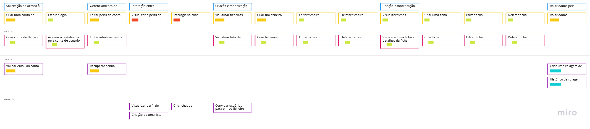
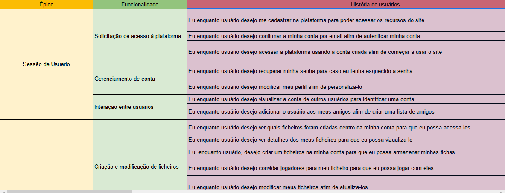

# User Story Mapping

## Histórico de Versão
|    Data    | Versão |                Descrição                |                     Autor                     |
| :--------: | :----: | :-------------------------------------: | :-------------------------------------------: |
| 04/04/2022 | 1.0 | Criação do USM| [Leonardo Takehana](https://github.com/ltakehana), [João Paulo Lima](https://github.com/jpaulohe4rt), [Gabriel Freitas](https://github.com/gabrielfreitass1), [Luíz Gustavo](https://github.com/LuizGustavoFR) |
| 27/04/2022 | 2.0 | Versão final do USM| [Gabriel Freitas](https://github.com/gabrielfreitass1)|

O principal objetivo do USM é ter um backlog estruturado visualmente facilitando o entendimento das histórias de usuário e sequenciando a prioridade de construção delas alem da jornada do usuário.É importante ressaltar que nossas personas são os jogadores de RPG.

 
<a href="https://miro.com/app/board/uXjVONjoEoU=/">Link para o nosso USM completo</a>

Nossos critérios de aceitação se encontram no próprio template do Miro.Também é possível visualiza-lo em nosso backlog.

 
<a href="https://docs.google.com/spreadsheets/d/1Yuifr4S3yzCtYWAnAohY2NCN6NN7VfXRMEdDdgyCWP4/edit?usp=sharing">Link para o nosso backlog completo</a>