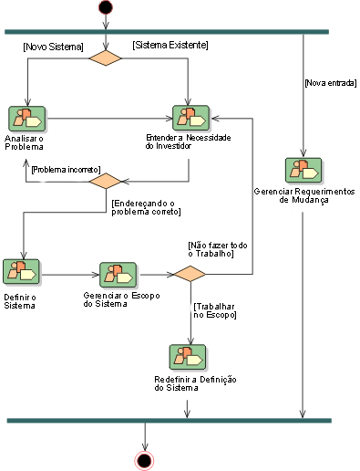

# Visão do Produto e Projeto

## Histórico de Versão
|    Data    | Versão |                Descrição                |                     Autor                     |
| :--------: | :----: | :-------------------------------------: | :-------------------------------------------: |
| 01/02/2022 |  2.0   | Encremento do Documento de Visão do Produto e Projeto | [Natan Santana](https://github.com/Neitan2001), [Leonardo Takehana](https://github.com/ltakehana), [João Paulo Lima](https://github.com/jpaulohe4rt), [Gabriel Freitas](https://github.com/gabrielfreitass1), [Luíz Gustavo](https://github.com/LuizGustavoFR) |

## 1 Visão Geral do Produto

### 1.1 Declaração do Problema

|   O Problema     | Jogadores de RPG possuem uma dificuldade para organizar as fichas de uma campanha de RPG de mesa, dificultando e atrasando a jogatina. |    
| :--------: | :----: | 
| Afeta |  Jogadores de RPG de mesa  | 
| Cujo Impacto é | Os jogadores acabam utilizando várias plataformas para jogar um jogo, as vezes até dependendo de materiais físicos e isso gera muita desorganização |
| Uma Solução Seria | A criação de uma aplicação web que permitiria a criação de ficheiros e fichas de rpg, permitindo que os jogadores as editem e joguem o jogo dentro da plataforma por meio da rolagem de dados automática | 

### 1.2 Declaração de Posição do Produto

|   Para    | Mestres e Jogadores de RPG(Role-playing game) de mesa     |    
| :--------: | :----: | 
| Quem | Necessita de uma facilidade e praticidade de organização de fichas para personagens | 
| O Tatsu| É uma ferramenta web | 
| Que | Permite a criação e o gerenciamento de fichas de personagens de RPG|
| Ao contrário | do aplitcativo para celular "Ficha Épica" |
| Nosso Produto | permite a criação de um ficheiro onde seria criado fichas individuais que podem ser atualizadas por qualquer jogador utilizando um link. Além disso, a nossa plataforma irá permitir que os jogadores rolem os dados de acordo com os atributos da ficha |

### 1.3 Objetivos do Produto

O objetivo principal do site Tatsu é permitir a criação de ficheiros que podem organizar fichas de personagens de RPG, permitindo que o usuários as editem a qualquer instante. Além disso, o site possui o objetivo secundário de facilitar a jogatina de um RPG de mesa por meio da plataforma ao permitir rolagem automática de dados de acordo com os atributos das fichas e histórico  de rolagem de dados, danos sofridos por cada personagem e experiência obtida durante combates

### 1.4 Escopo do projeto

#### 1.4.1 Requisitos Funcionais

* Criar conta de usuário
* Confirmar criação da conta de usuário por email
* Recuperar senha da conta de usuário
* Editar informações de cadastro do usuário
* Acessar modo jogo a partir do ficheiro e da ficha
* Definir turno dos jogadores
* Definir um temporizador de turno
* Consultar perfil de outros usuários
* Criar guildas
* Editar guildas
* Deletar guildas
* Adicionar jogadores à guilda
* Mandar mensagem em um chat dentro do ficheiro
* Definir visibilidade de vida no modo jogo
* Desabilitar temporizador
* Registrar valor das rolagens de dado no chat do ficheiro
* Rolar dados
* Acessar a plataforma pela conta de usuário já existente
* Criar ficheiros
* Editar ficheiros
* Deletar ficheiros
* Criar fichas dentro do ficheiro
* Editar fichas dentro do ficheiro
* Deletar fichas dentro do ficheiro

#### 1.4.2 Requisitos Não-Funcionais

* Poder acessar através de computadores com diferentes tamanhos de tela (responsividade)
* A plataforma precisa ter modelos de ficha pré prontos
* A rolagem de dados, os cálculos de danos e experiências devem ser realizados em menos de 5 segundos
* O site possuirá um tutorial de utilização
* As fichas devem ser criadas de acordo com o sistema de jogo de D&D (Dungeons e Dragons)
* A plataforma deverá conter ao menos 6 tipos de dados

#### 1.4.3 Mínimo Produto Viável

* Criar conta de Usuário
* Rolar dados
* Acessar a plataforma pela conta de usuário já existente
* Criar ficheiros
* Editar ficheiros
* Deletar ficheiros
* Criar fichas dentro do ficheiro
* Editar fichas dentro do ficheiro
* Deletar fichas dentro do ficheiro

## 2 Abordagem de Desenvolvimento de Software

Para a metodologia foi escolhido um modelo com base em princípios ágeis que seja adaptável a nossa realidade para otimizar os processos de desenvolvimento, utilizando elementos do SCRUM, XP e também do RUP.
Os elementos utilizados com base no SCRUM serão as sprints, organizadas com duração de 2 semanas, com sprints reviews e sprint plannings definidos e alguns papéis como P.O e Scrum Master, além de uma reunião semanal de acompanhamento. 
Para otimizar o aprendizado e as revisões será utilizado o pair programming do XP, de maneira que a cada sprint o pareamento dos membros sejam permutados de maneira a fazer com que todos interajam entre sí, melhorando o relacionamento dos desenvolvedores no projeto.
Por fim, o processo seguirá os conceitos do RUP, com algumas modificações, utilizando as etapas do fluxo de desenvolvimento especificado de acordo com essa metodologia, dividindo nas etapas: modelagem de negócio, requisitos, análise e design, implementação, teste e implantação.

## 3 Abordagem de Engenharia de Requisitos

A abordagem de Engenharia de Requisitos terá como base o padrão proposto pelo Processo Unificado, com leves modificações, onde primeiro iremos análisar o problema, entender a necessidade dos stakeholders, definir o sistema, gerenciar o escopo do sistema e por fim continuar refinando a definição do sistema, dessa forma serão seguidas essas etapas para construção de requisitos funcionais e também os não funcionais, para que no final todos os requisitos do sistema sejam atendidos.

É possível observar o fluxo da abordagem de Engenharia de Requisitos pelo fluxograma abaixo:

De acordo com essa imagem podemos separar a engenharia de requisitos em 6 etapas, onde cada uma corresponderia a uma etapa das atividades da disciplina.

Começando com a etapa de elicitação de requisitos, onde serão executadas as atuvudades de Analizar o Problema e Entender as Necesidades dos Stakeholders, onde serão feitos brainstormings com o objetivo de coletar todas as ideias de requisitos do grupo para o nosso projeto.

Na segunda etapa seria a de análise de requisitos, onde no RUP seria o equivalente a definir o sistema, nessa etapa seriam filtrados os requisitos levantados na elicitação e classificados como funcionais ou não funcionais.

Após isso na etapa de documentação dos requisitos, seguirá a etapa de gerenciar o escopo do sistema, com modificações de acordo com a proposta do RUP, pois no lugar de utilizar casos de uso, iremos trabalhar com historias de usuários, épicos e features, pois se adapta melhor a abordagem mesclada com as Sprints que iremos utilizar, pois isso torna mais fácil a divisão em issues bisemanais para a execução de atividades de desenvolvimento. 

Na etapa de verificação e validação de requisitos iremos refinar a definição do sistema durante as sprints, verificando o andamento do projeto de acordo com o cronograma definido pelo Scrum Master e verificar se tudo está de acordo, além de definir e específicar os requisitos cada vez mais

Por ultimo temos o gerenciamento de requisitos que no RUP irá corresponder a gerenciar os requisitos variaveis, onde consiste em rever os requisitos e se houve alguma alteração de acordo com a verificação da etapa anterior, para refazer prioridades ou possíveis alterações no escopo do sistema que podem ser causadas por algum elemento não previsto.

### 3.1 Elicitação de Requisitos
|Atividade|Método|Ferramenta|
|:-------:|:----:|:--------:|
| Analizar o Problema| Brainstorming | Plataforma "Miro"|
| Entender as Necesidades dos Stakeholders | Brainstorming | Plataforma "Miro"|

### 3.2	Análise de Requisitos
|Atividade|Método|Ferramenta|
|:-------:|:----:|:--------:|
|Definir o Sistema| Separação dos requisitos levantados no brainstorming das etapas anteriores, para classifica-los como funcionais ou não funcionais | Plataforma "Miro" |

### 3.3	Documentação de Requisitos
|Atividade|Método|Ferramenta|
|:-------:|:----:|:--------:|
|Gerenciar o escopo do sistema | Separar os requisitos análisados em Histórias de Usuário, Épicos e Features e definir prioridades de execução| Planilha do Google Sheets |

### 3.4	Verificação e Validação de Requisitos
|Atividade|Método|Ferramenta|
|:-------:|:----:|:--------:|
|Refinar a Definição do Sistema| Conferir se os requisitos foram atendidos através de testes de software e também a validação constante se esses requisitos ainda fazem sentidos, sendo realizadas ao final de cada Sprint durante a reunião de Sprint Review| Testes de software, reuniões online e planilha do Google Sheets |

### 3.5	Gerenciamento de Requisitos
|Atividade|Método|Ferramenta|
|:-------:|:----:|:--------:|
| Gerenciar requisitos variáveis |Durante o desenvolvimento, no sprint planning de cada Sprint serão revistos todos os Requisitos que não fizeram sentido de acordo com a validação e verificação da etapa anterior e será feita a alteração dos atributos de requisito e mudanãs nos relacionamentos de rastreabilidade caso necessários| Planilha do Google Sheets e reuniões virtuais |

## 4 Visão Geral Do Projeto

### 4.1 Organização do projeto

|Papel|Atribuições|Participantes|
|:-------:|:----:|:--------:|
| Product Owner| Desenvolver e transmitir com clareza o objetivo do produto, assim como a criação do backlog, solicitar a implementação de funcionalidades e também garantir que o backlog do produto seja algo transparente, visível e compreensível. | Natan Santana|
| Scrum Master | O Scrum Master é o responsável por garantir que os rituais do Scrum sejam seguidos, age como um facilitador das dailys, sprint reviews e sprint planning | Leonardo Takehana|
| Desenvolvedores | Serão as pessoas que estarão comprometidas com a realização das Sprints de desenvolvimento e codificar a ideia no produto | Leonardo Takehana, Natan Santana, João Paulo Lima, Gabriel Freitas, Luíz Gustavo  |

### 4.2 Planejamento das Fases e/ou Iterações do Projeto

|Sprint|Produto (Entrega)|Data Início| Data Fim |
|:-------:|:----:|:--------:| :--------:|
| Sprint 1| Criar conta de Usuário, Acessar a plataforma pela conta de usuário já existente, Criar ficheiros  | 28/02/2022 | 14/03/2022 |
| Sprint 2| Editar ficheiros, Deletar ficheiros | 14/03/2022 | 28/03/2022 |
| Sprint 3| Criar fichas dentro do ficheiro, Editar fichas dentro do ficheiro (MVP 1)  | 28/03/2022 | 11/04/2022 |
| Sprint 4| Deletar fichas dentro do ficheiro, Rolar dados (MVP 2) | 11/04/2022 | 25/04/2022 |

### 4.3 Matriz de Comunicação

|Descrição|Área/Envolvidos|Periodicidade|Produtos Gerados|
|:-------:|:----:|:--------:|:--------:|
| Reunião de Planejamento da Sprint (Planning) |  Scrum, PO e Desenvolvedores | Quinzenal |Priorização das atividades que serão executadas dentro da Sprint recém iniciada. |
| Revisão da Sprint (Sprint Review) | Scrum, PO e Desenvolvedores | Quinzenal | Validação as entregas da equipe e verificar se os critérios estabelecidos no planejamento foram executados. |

### 4.4 Gerenciamento de Riscos

| Risco | Consequência | Ações de Mitigação |
|:-----------:| :----------: |:-------------------------------:|
| Má gestão do projeto | O projeto pode não ser entregue no prazo | Acompanhamento constante nas reuniões de Sprint planning e Sprint Review por parte do gestor e de todos os membros da equipe de desenvolvimento.|
| Falta de experiência da equipe | O projeto pode passar por bugs, atrasos ou funcionalidades indisponíveis  | Pareamentos com pessoas mais experientes e recorrer ajuda externa. |
| Não conseguir um servidor de hospedagem | O serviço ficará fora do ar ou criará custos com manutenção em um servidor pago | Olhar varias alternativas ao início do projeto e tentar disponibiliza-las para teste. |
|Algum membro do projeto retirar a disciplina| As atividades do membro em questão ficarão sem pessoa atríbuida, o que irá dificultar o andamento do projeto e causar sobrecarga nos membros restantes. | Replanejar todas as atividades e redistribuí-las entre os membros atuais para que o andamento do projeto não seja prejudicado. |
| Algum membro adoecer | As atividades do membro em questão ficarão sem pessoa atríbuida, o que irá dificultar o andamento do projeto e causar sobrecarga nos membros restantes. | Replanejar todas as atividades e redistribuí-las entre os membros atuais para que o andamento do projeto não seja prejudicado. |
| As aulas serem suspensas novamente por algum motivo externo | O semestre é pausado e por conta disso o projeto não é concluído | O projeto é descontinuado. |
| As técnologias do projeto são descontinuadas pelos mantenedores | O projeto fica defasado e sujeito a falhas de segurança | É necessário um replanejamento e talvez a refatoração de algumas funcionalidades com novas tecnologias.|
| Hackers invadem o servidor do projeto | O projeto tem seus dados vazados e pode ser derrubado do ar. | O uso de tecnologias mais seguras e configuração do servidor utilizando barreiras de segurança como firewall e o protocolo https. |
| Incompatibilidade entre as tecnologias ou pacotes utilizados no projeto | O projeto tem inconsistencias bugs ou pode não abrir alguma página. | Conferir a documentação de todos os pacotes e realizar testes na plataforma. |
| Falha de alguma funcionalidade causada por um código mal escrito | O projeto tem inconsistencias bugs ou pode não abrir alguma página. | Conferir todas as funcionalidades e testa-las sempre antes de realizar um merge na branch principal. |
|Código desorganizado. | Gera dificuldade em dar manutenção no produto futuramente causando problemas aos desenvolvimento do projeto. | Organização durante o desenvolvimento sempre revisada por um pareamento.|

### 4.5 Critérios de Replanejamento

## 5 Lições Aprendidas

### 5.1 Unidade 1

Durante essa primeira etapa, podemos aprender mais sobre o Processo Unificado e sua forma de gerenciamento de requisitos, além de aprendermos sobre a configuração e disponibilização do mkdocs no github pages.

## 6 Referências Bibliográficas

> [Ficha Épica](https://ficha.epicorpg.com.br/)

> [RUP Homepage](https://sceweb.uhcl.edu/helm/RationalUnifiedProcess/)
